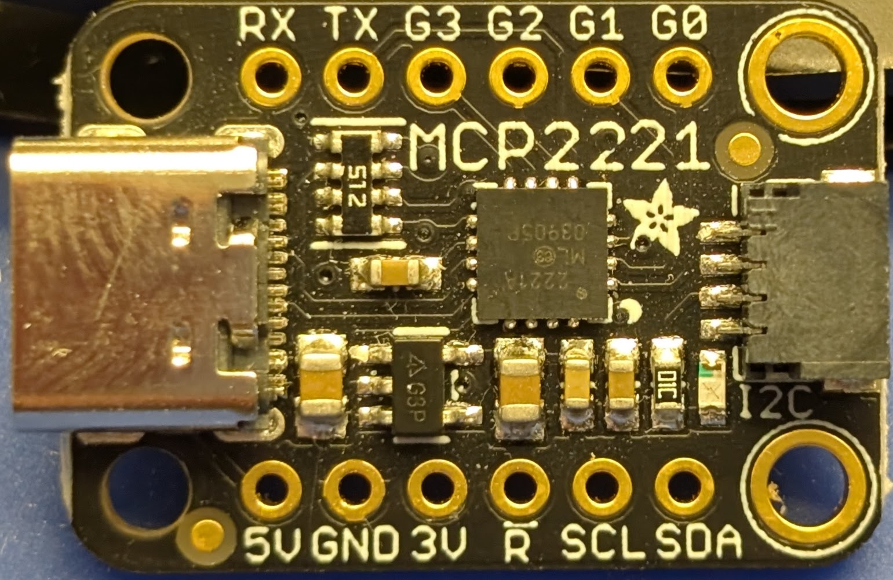
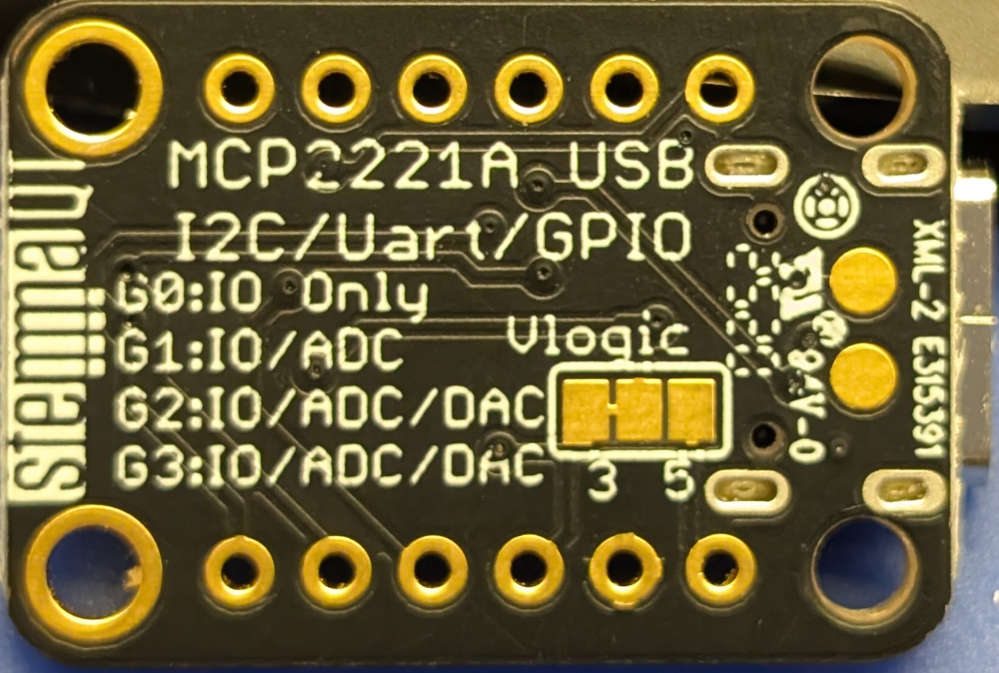
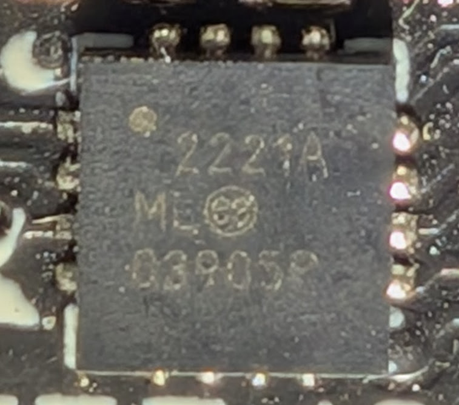

# Adafruit MCP2221A Breakout 4471

[Adafruit MCP2221A Breakout - General Purpose USB to GPIO ADC I2C - Stemma QT / Qwiic](https://www.adafruit.com/product/4471)

## Reference material:

* [Product Link](https://www.adafruit.com/product/4471)
* [Schematics, etc](https://learn.adafruit.com/circuitpython-libraries-on-any-computer-with-mcp2221/downloads)
* [Firmware update]()
* [Open firmware]()

## Board





### Chip



Package QFN-16

Markings:

```text
2221A
ML E3
03905P
```

[Datasheet](http://ww1.microchip.com/downloads/en/DeviceDoc/20005292C.pdf)

## Firmware

There is probably a bit of firmware, but I didn't mess with it.
